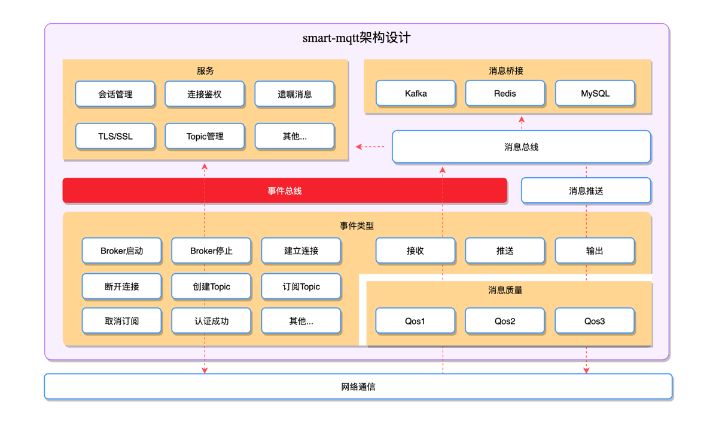

smart-mqtt 所有的数据、服务都是依托于事件总线驱动的。
数据总线造就了 smart-mqtt 极具灵活的扩展性，熟练掌握并运用该特性可以轻松应对各类复杂的场景需求。


## 接口设计
从消息总线的接口设计可以看出，它的运作原理就是经典的生产/消费模型。
```java
public interface EventBus {

    <T> void subscribe(EventType<T> type, EventBusSubscriber<T> subscriber);

    <T> void subscribe(List<EventType<T>> types, EventBusSubscriber<T> subscriber);

    <T> void publish(EventType<T> eventType, T object);
}
```
其中`EventBus#publish`已被安插在各个恰当的位置，当发生相应事件的时候会由 smart-mqtt 框架自动触发。

为了实现 MQTT Broker 的基础功能，smart-mqtt 已经通过`EventBus#subscribe`订阅了部分事件。

当然，当你[开发插件](/smart-mqtt/plugins.html)的时候，也可以通过订阅关注的事件实现自己想要的功能。
但在此之前，最好先了解下各个事件类型的特性及触发条件。

## 事件类型
### 接收消息（RECEIVE_MESSAGE）
触发条件：完成MQTT消息解码，并即将进行消息处理时。
### 输出消息（WRITE_MESSAGE）
触发条件：即将往TCP通道发送一条消息。

### BROKER_STARTED
触发条件：Broker服务完成初始化，并启动成功。
### BROKER_DESTROY
触发条件：Broker 停止服务。
### CONNECT
触发条件：客户端发送的 ConnectMessage 认证通过。
### DISCONNECT
触发条件：客户端与Broker的TCP连接断开。
### SESSION_CREATE
触发条件：建立了新的 TCP 连接，并完成 MQTT Session 初始化。
### TOPIC_CREATE
触发条件：Broker 接收到一个新的Topic订阅。
### SUBSCRIBE_TOPIC
触发条件：客户端连接订阅了某个Topic。
### RECEIVE_PUBLISH_MESSAGE
触发条件：Broker收到来自客户端发送的 PublishMessage。
### PUSH_PUBLISH_MESSAGE
触发条件：Broker向某个客户端连接推送一次订阅的消息。
