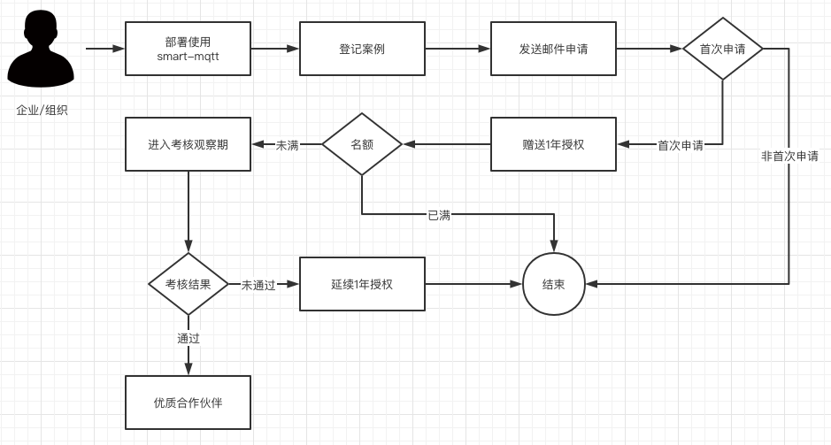

<p align="center">
  <a href='https://gitee.com/smartboot/smart-mqtt/releases/tag/v0.8' target="_blank"></a>
  <a href='https://gitee.com/smartboot/smart-mqtt' target="_blank"></a>
  <a href='https://gitee.com/smartboot/smart-mqtt' target="_blank"></a>
  <a href="https://github.com/smartboot/smart-mqtt" target="_blank"></a>
  <a href="https://github.com/smartboot/smart-mqtt" target="_blank"></a>
</p>

## 🎉 加入企业支持计划
smart-mqtt 在开源的同时，还将提供一些列商业化服务。如果您所在的企业/组织有这类需求，请先联系我们获得商业授权，避免不必要的纠纷。

**目前项目还处于公测阶段，暂未正式开放商业授权通道。**

现阶段我们正在进行企业支持计划，参与该计划的企业/组织将有机会在未来享受商业版不同程度的福利，譬如：免费授权、折扣优惠。

### 一、申请流程

1. 在企业中部署使用 [smart-mqtt服务](https://gitee.com/smartboot/smart-mqtt/releases) ，并完成[案例登记](https://gitee.com/smartboot/smart-mqtt/issues/I5ZOP0)。
2. 发送邮件至：zhengjunweimail@163.com 申请加入《smart-mqtt企业支持计划》。邮件内容包括：
   - 企业名
   - 统一社会信用代码
   - 应用场景描述
   - 企业Logo
3. 收到邮件颁发的授权证书视为申请通过。

### 二、关于考核观察期
- 考核期限：自申请通过之日起 1 年。
- 考核项：
  1. smart-mqtt 使用情况反馈。
  2. 在企业产品宣传中露出 smart-mqtt（图片、文案、链接皆可）。
  3. 协助推广 smart-mqtt 产品。
- 后续补充...

### 三、优质合作伙伴福利
1. 等同于黄金赞助商的Logo展示机会。
2. 申请成为赞助商时可享受8折优惠。
3. 其余福利可基于双发协商而定。

### 四、案例登记
::: cardList 3
```yaml
- name: 案例反馈
  desc: "优质的案例值得被更多人看见"
  link: https://gitee.com/smartboot/smart-mqtt/issues/I5ZOP0
  avatar:  /img/png/add.png
  bgColor: '#DFEEE7'
- name: 北京盈泽世纪科技有限公司
  desc: "数据监控"
  link: http://www.yingzeshiji.com.cn/
  avatar:  ./img/user_yzsj.png
```
:::