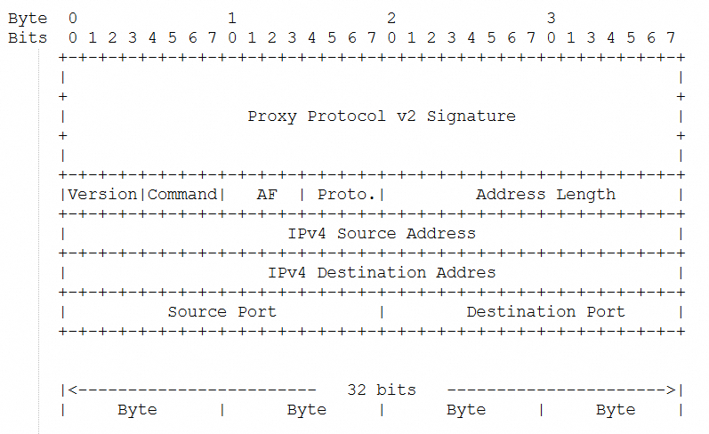
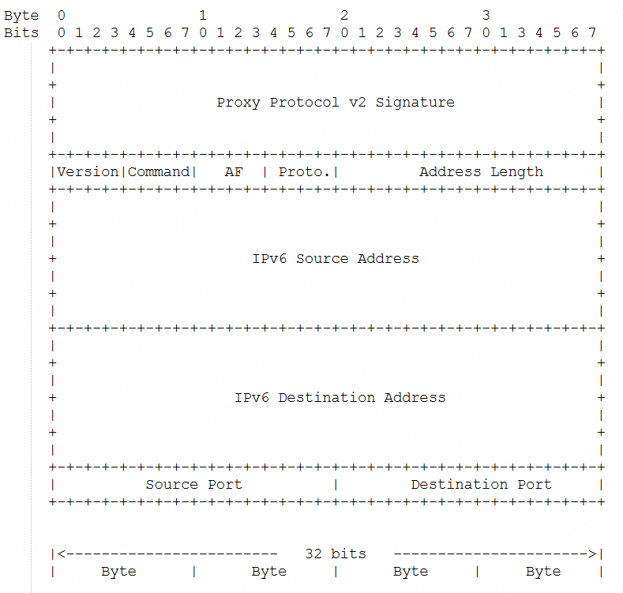

## 背景
随着互联网应用的发展，负载均衡技术得到了广泛应用。
在早期的网络架构中，当客户端直接连接后端服务器时，后端服务器可以直接获取客户端的真实 IP 地址等连接信息。
然而，当引入负载均衡器（如 HAProxy、Nginx 等）来分发流量，以提高应用的可用性、可扩展性和性能后，问题就出现了。

负载均衡器位于客户端和后端服务器之间，它会接收客户端的请求，然后将请求转发到后端服务器。
在这个过程中，后端服务器看到的请求源 IP 地址是负载均衡器的 IP 地址，而不是客户端的真实 IP 地址。
这就导致后端服务器在进行一些基于客户端 IP 的操作（如访问控制、日志记录等）时出现不准确的情况。

**场景需求**
- **访问控制与安全策略**：许多服务器应用需要基于客户端的真实 IP 地址来实施访问控制。例如，一个 Web 应用可能希望只允许来自特定 IP 网段的客户端访问，或者对频繁请求的客户端 IP 进行限制。如果后端服务器获取的是负载均衡器的 IP，这些安全策略将无法正确实施。
- **准确的日志记录**：对于服务器的日志系统来说，记录客户端的真实 IP 地址对于分析用户行为、排查安全问题等非常重要。如果记录的是负载均衡器的 IP，就无法准确追踪客户端的来源和行为模式。
- **基于 IP 的应用功能**：一些应用可能会根据客户端的 IP 地址提供个性化的服务，如地理定位相关的内容推送等。没有客户端真实 IP，这些功能将受到影响。

## Proxy Protocol 简介
为了解决上述问题，Proxy Protocol 应运而生。它是一种在负载均衡器和后端服务器之间传递客户端连接信息（如客户端 IP 地址、端口等）的协议。通过在负载均衡器和后端服务器之间建立一种标准的信息传递机制，使得后端服务器能够获取客户端的真实连接信息，就好像客户端是直接连接到后端服务器一样。

这样，后端服务器可以继续基于准确的客户端 IP 进行访问控制、日志记录等操作，而不会因为负载均衡器的存在而丢失这些重要信息。Proxy Protocol 的出现有效地填补了负载均衡场景下客户端连接信息传递的空白，使得网络架构在引入负载均衡器的情况下依然能够保持后端服务器对客户端信息的准确获取和处理能力。


### 协议差异
| 协议   | PROXY Protocol v1                                   | PROXY Protocol v2                             |
|------|-----------------------------------------------------|-----------------------------------------------|
| 格式   | ASCII文本格式。                                          | 二进制格式。                                        |
| 支持协议 | TCP                                                 | TCP、UDP                                   |
| 安全性  | 无加密或认证机制，数据容易被篡改，安全性相对较低。                           | 引入了TLS握手信息，安全性较高                              |
| 兼容性  | 固定格式，扩展性有限，灵活性较低。                                   | 可变长度，支持多种扩展信息，灵活性较高。                          |
|场景| 只需要简单的 TCP 代理并且对安全性要求不高，可以选择 **Proxy Protocol V1**。 | 需要更高的安全性，建议使用 **Proxy Protocol V2**。 |

### V1协议示例
```text
PROXY TCP4 192.168.0.1 192.168.0.11 56324 443\r\n
GET / HTTP/1.1\r\n
Host: 192.168.0.11\r\n
\r\n
```

### V2解析格式
- IPv4地址的PROXY 协议二进制标头格式：

- IPv6地址的PROXY 协议二进制标头格式：


## ProxyProtocolPlugin的使用
smart-socket 提供的 ProxyProtocolPlugin 插件，同时支持 Proxy Protocol V1 和 V2 规范。

**示例**

```java
processor.addPlugin(new ProxyProtocolPlugin<>());
```
