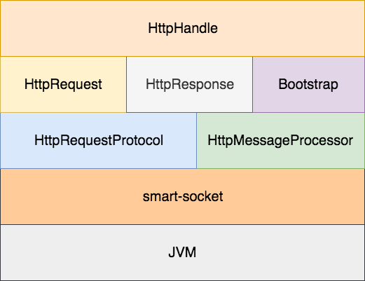

**快速上手**

JDK1.7 是采用 smart-http 进行开发的最低版本要求，并且我们推荐采用 maven 方式将 smart-http 依赖引入您的工程中。
```xml
<!-- https://mvnrepository.com/artifact/org.smartboot.http/smart-http-server -->
<dependency>
    <groupId>org.smartboot.http</groupId>
    <artifactId>smart-http-server</artifactId>
    <version>1.0.12</version>
</dependency>
```

下图为 smart-http 的工程架构，我们基于 smart-socket 实现了 Http 协议的解析和请求的处理逻辑。
HttpRequest 和 HttpResponse 定义了 http 请求/响应的操作接口，HttpBootstrap 提供了配置、启动 http 服务的能力，
而用户只需要在 HttpHandler 中实现自身业务逻辑，并将其注册至 HttpBootStrap 便可。
 



用实际代码演示 http 服务的开发如下所示。
```java
public class SimpleSmartHttp {
    public static void main(String[] args) {
        HttpBootstrap bootstrap = new HttpBootstrap();
        bootstrap.pipeline().next(new HttpHandle() {
            @Override
            public void doHandle(HttpRequest request, HttpResponse response) throws IOException {
                response.write("hello world<br/>".getBytes());
            }
        });
        bootstrap.setPort(8080).start();
    }
}
```

启动程序后打开浏览器访问：`http://127.0.0.1`，页面中会输出：**Hello World**


### 小结
通过以上描述我们看到用 smart-http 进行 http 服务开发是非常简单的。
当然在实际场景下我们面临的情况会更为复杂，例如：请求路由、静态资源服务、文件上传/下载等。
我们会尽可能的为大家整理这些场景的处理方案，无所谓教程，分享交流而已。