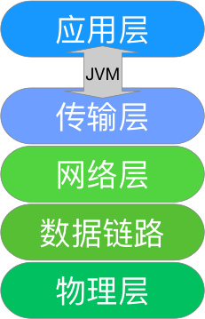

## 常见误区

### 1. smart-socket能否解决半包粘包？

​	不能！框架也没这个义务和能力做这件事。或许有些朋友会出来反驳：Netty提供的解码器不是处理了这个问题吗？如果您是这样认为的，也许现阶段您还是个Socket的初学者并刚刚开始接触netty，又或者对**半包/粘包**有所误解。

​	首先，我们要理解“包”是个什么概念。一个Http消息可以称之包，一个RPC消息也可以称之为包，所以大家可以把“包”等同于“请求/响应消息”去理解。

​	这样一来半包的情形便如下所示，一个完整的Http请求消息为：

```http
GET /smart-socket HTTP/1.1\r\n
Host socket.smartboot.org\r\n
\r\n
```

​	而我们的Socket实现代码在执行read时没有一次性读完整个消息，第一次read到的内容为：

```http
GET /smart-socket HTTP/1.1\r\n
```

​	第二次read到的内容为：

```http
Host socket.smartboot.org\r\n
\r\n
```

> 问题来了，Http消息发送只需要操作一次write，为什么执行read却分多次呢？

​	此处就要引入关于TCP传输的一些知识点了，当然我们讲的会比较粗浅。用户所感知到的读、写操作，只是Java语言暴露出来的API。尽管你执行消息发送只调用了一次write接口，但在操作系统底层可能执行了多次输出操作才完成这一个消息发送任务。

​	读操作亦如此，当你调用read接口的时候，操作系统会尽力去读取可读的数据。但总会遇到某些因素导致一个消息要调用多次read才读取完整。或许是由于你设置的读缓冲区大小不够``(byte数组)``，无法承载完整的请求消息，以致于需要分批read才能加载完消息。又或者网络状况不好，本次只能读到一部分，需要您尝试多次read。这类场景便导致了所谓的“半包”。

​	粘包的情况刚好与半包相反，不多做描述。可能有人会抱怨，为什么Java提供的read接口不能智能识别消息边界，根治半包/粘包问题。此处不得不为Java喊冤，大家都知道Socket底层通信是数据流的传递，就是把一堆byte数组转换成二进制传递到对端。传输层【见下图】只负责数据的传递，它干不了别的事，甚至不知道传递的内容是什么。对它来说只关心两件事：1、传输通道是否正常；2、是否有数据需要读写。



<center>TCP/IP模型</center>

JVM作为夹在传输层与应用层的”第三者“也是束手无策的。真正能掌控这一切都在于应用层，也就是开发人员自己手中。只有开发人员才知晓自己传输的消息协议是什么？消息与消息的边界在哪里？该如何定性？

​	回到本节讨论的话题，处于应用层的框架为何还解决不了半包/粘包问题？从框架所处的层级位置来讲，其下游的传输层是在框架的控制范围内的，框架通过可以操控JVM暴露出来的读写接口，协调IO与CPU资源。但对上层的应用协议是未知的，只有开发人员明确指定协议，例如：Http、FTP、SNTP等，框架才能提供稳定、可靠的通信服务。所以，应用协议的消息编解码实现是开发人员的职责，半包/粘包也是开发人员需要考虑并解决的问题。那些所谓的某某通信框架提供了半包/粘包的解决方案，是不准确的。框架能做的，仅仅是提供一些辅助开发人员完成编解码的工具类罢了。而这种工具类也无非是提供`特定长度`、`特定结束符`的解析能力。之所以大家对半包/粘包谈之色变，以及过渡依赖框架，皆因对”协议“的概念理解不到位，本书会专门讲解已解大家心头之惑。希望看到本书的有缘之人，人人都能成功通信高手。

------

### 2. 服务端如何主动发消息？

​	这个问题在笔者建立的交流群中出现过数次，问题本身其实比较低级，但的确是不少初学者面临的困惑。在大多数初学者的思维定式中，消息的通信模式肯定是客户端发送一个请求消息，服务端再返回一个响应消息。一旦遇到需要服务端主动下发消息至客户端时候，懵了。

​	个人认为造成这状况的原因是每个人学习Socket编程的途径都是通过书本和示例代码，但所有的示例中提供的通信模式都是Client发送“Hello World”至Server，Server端在返回一个字符串。这种粗糙的示例代码没有给读者讲清楚Client/Server的通信模式，没有区分建立连接与数据通讯的行为差异。以致于通过这种方式步入通信领域的开发朋友在未来很长时间内都以一种不正确的方式在“玩”Socket，遇到示例代码之外的问题哭天喊地不得解。在此笔者为大家明确几个要点：

1. 通信连接是由客户端主动发起的，服务端被动接受的
2. 连接建立好后服务端与客户端是对等的，相互之间都可以主动发消息
3. 发送消息与接收消息是可以发生在同一时刻的。假如是单线程操作，只能先完成读/写事件后再处理写/读事件；或者采用多线程的方式并行处理。还不理解可以百度一下“双工通信”的概念，假设一下打电话的场景，你在接收对方语音的同时并不妨碍自己发言，听与说是可以并行的，Socket通信也一样。

**回归正题：服务端如何主动发消息？请继续阅读本书，相信你会找到答案！**


