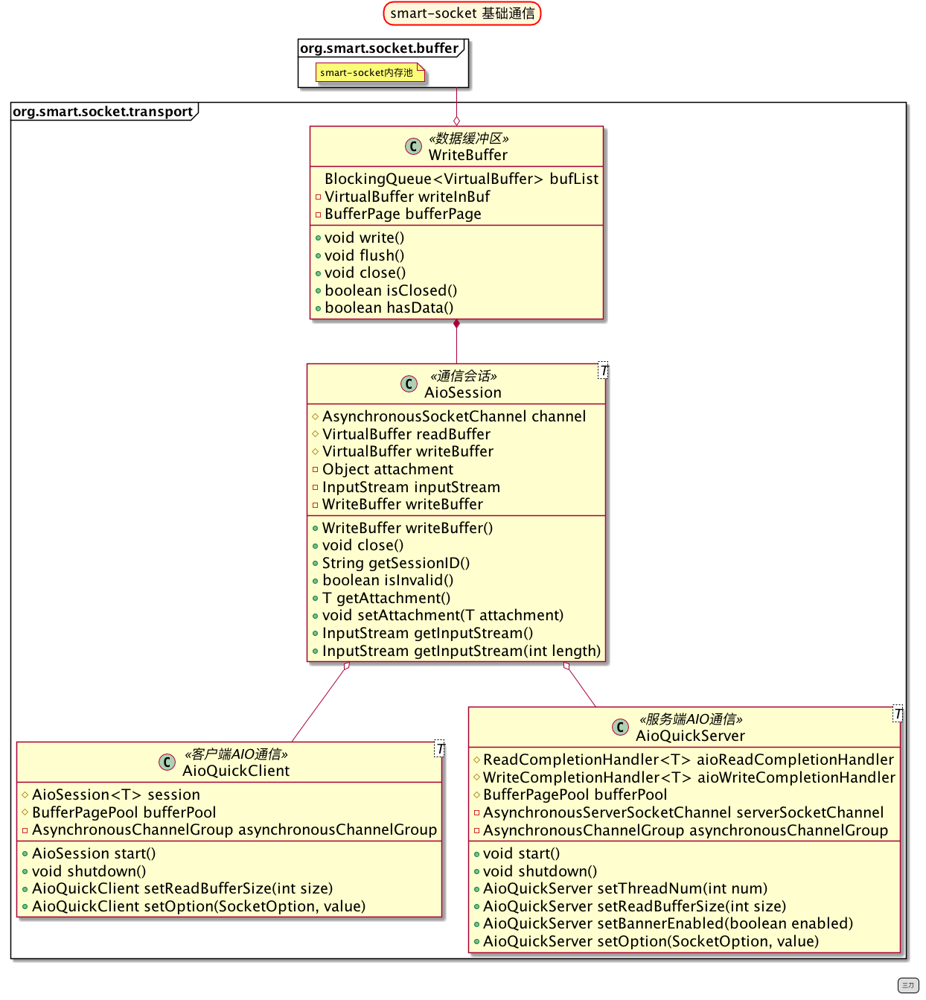

## 第三章 smart-socket源码解析

smart-socket的源码部分主要分三部分：基础通信、TLS/SSL通信、内存池。本章只分享基础通信部分的内容，这部分对于绝大多数的开发人员都是比较有意义的。而TLS/SSL比较复杂，作者自认很难以通俗易懂的文字给读者讲解清楚，对于高级开发人员而言通过看源码应该能领悟一些门道，故本书暂不提及此部分内容。内存池是smart-socket 1.4 加入的新特性，是作者在研究 Netty 内存池却始终无法领悟其精髓后决定自研的一套模型，在第四章中有详细的说明。

考虑到smart-socket在版本迭代中会有一些细小变化，本章会筛选核心的部分进行代码解读。
如果在实际中发现文章内容与代码有出入，则以你当前所使用的版本为准。
smart-socket的整体代码结构如下所示。
 

