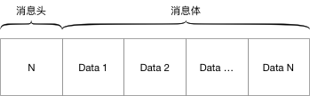

## 核心接口

业界有句话叫“一流的卖标准、二流的卖技术、三流的卖产品”，
如果说smart-socket的技术价值仅算二流水准的话，
那么我们为其精心设计的接口期望能稍微提升一下它的档次。
基于smart-socket进行通信开发的主要工作量全部集中在两个接口的实现：`Protocol`、`MessageProcessor`。

两个接口各自都有明确的分工，Protocol负责解析数据形成消息实体，MessageProcessor负责对Protocol解析出来的消息进行业务处理。当然，你也可以在Protocol中一次性完成解析、业务处理，又或者将Protocol当个摆设，所有事情集中在MessageProcessor完成。smart-socket不限制你实现功能的自由性，只是提供一个更规范、更合理的建议，最终决定权还是在用户的手中。

### 1. Protocol

```java
public interface Protocol<T> {
    /**
     * 对于从Socket流中获取到的数据采用当前Protocol的实现类协议进行解析。
     *
     * <p>
     * 实现的解码方法要尽可能读取readBuffer已有的数据。若不及时解析并最终导致readBuffer无可用空间（即readBuffer.remaining==0），smart-socket会反复触发decode方法形成类似死循环的效果。
     * </p>
     *
     * @param readBuffer 待处理的读buffer
     * @param session    本次需要解码的session
     * @return 本次解码成功后封装的业务消息对象, 返回null则表示解码未完成
     */
    T decode(final ByteBuffer readBuffer, AioSession<T> session);
}
```

Protocol是一个泛型接口，`<T>`指的是业务消息实体类，smart-socket中不少地方都运用了泛型设计，其含义都代表数据解码后封装的消息类型。Protocol中只定义了一个方法`decode`。

decode（消息解码），AIO的数据传输是以ByteBuffer为媒介的。所有读取到的字节数据都会填充在ByteBuffer中并以事件回调的形式触发Protocol#decode()方法。所以我们实现的decode算法就是ByteBuffer对象转化为业务消息`<T>`的过程。

需要强调一点，读者朋友请不要把解码想的很简单，令人“深恶痛绝”的半包/粘包就是在这个环节需要应对的。处理方式也不难，**遵守以下两点即可**：

1. 根据协议解析每一个字段前，都要先确保剩余数据满足解析所需，不满足则终止该字段解析并返回null。
2. 当已读的数据已满足一个完整业务消息所需时，立即构造该业务对象并返回，无需关心ByteBuffer中是否有剩余的数据。

考虑到有些读者对上述两点还不甚理解，我们通过两个示例来模拟通信过程中的半包、粘包场景。通信协议依旧是如1.1节中的定义的类型：




- 半包

  ```java
  public class StringProtocol implements Protocol<String> {
      public static void main(String[] args) {
          StringProtocol protocol = new StringProtocol();
          byte[] msgBody = "smart-socket".getBytes();
          byte msgHead = (byte) msgBody.length;
          System.out.println("完整消息长度:" + (msgBody.length + 1));
          ByteBuffer buffer = ByteBuffer.allocate(msgBody.length);
          buffer.put(msgHead);
          buffer.put(msgBody, 0, buffer.remaining());
          buffer.flip();
          System.out.println(protocol.decode(buffer, null));
      }
  
      public String decode(ByteBuffer buffer, AioSession<String> session) {
          buffer.mark(); 
          byte length = buffer.get(); 
          if (buffer.remaining() < length) { 
              System.out.println("半包：期望长度:" + length + " ,实际剩余长度:" + buffer.remaining());
              buffer.reset(); 
              return null;
          }
          byte[] body = new byte[length];
          buffer.get(body); 
          buffer.mark(); 
          return new String(body); 
      }
  }
  ```

  根据协议规定，完整的消息长度是字符串“smart-socket”字节数加一个字节的消息头，即13位。但因接收数据的ByteBuffer空间不足导致无法容纳整个消息，此时执行解码算法`decode`便等同于通信中的半包，运行后控制台打印如下：

  ```
  完整消息长度:13
  半包：期望长度:12 ,实际剩余长度:11
  null
  ```

- 粘包

  ```java
  public class StringProtocol implements Protocol<String> {
      public static void main(String[] args) {
          StringProtocol protocol = new StringProtocol();
          byte[] msgBody = "smart-socket".getBytes();
          byte msgHead = (byte) msgBody.length;
          System.out.println("完整消息长度:" + (msgBody.length + 1));
          ByteBuffer buffer = ByteBuffer.allocate((msgBody.length + 1) * 2);
          //第一个消息
          buffer.put(msgHead);
          buffer.put(msgBody);
          //第二个消息
          buffer.put(msgHead);
          buffer.put(msgBody);
          buffer.flip();
          String str = null;
          while ((str = protocol.decode(buffer, null)) != null) {
              System.out.println("消息解码成功:"+str);
          }
      }
  
      public String decode(ByteBuffer buffer, AioSession<String> session) {
          if (!buffer.hasRemaining()) {
              return null;
          }
          buffer.mark();
          byte length = buffer.get();
          if (buffer.remaining() < length) {
              System.out.println("半包：期望长度:" + length + " ,实际剩余长度:" + buffer.remaining());
              buffer.reset();
              return null;
          }
          byte[] body = new byte[length];
          buffer.get(body);
          buffer.mark();
          return new String(body);
      }
  }
  ```

  粘包出现于已读数据的部分超过了一个完整的消息长度。如demo所示，我们在ByteBuffer中放入了符合协议贵的两个完整消息，按照解码算法解析出第一个消息里立即返回`new String(body)`，待该消息处理完成后再进行下一次解码。故上述例子的控制台打印如下：

  ```
  完整消息长度:13
  消息解码成功:smart-socket
  消息解码成功:smart-socket
  ```

至此我们已经为大家介绍了Protocol的特性以及对于半包粘包的处理方式，当然真实场景下我们会面临更复杂的协议，对于半包粘包的处理方式也是多种多样，在通信协议章节在详细说明。

> 如果您选用的smart-socket版本低于v1.4，在该接口中还有一个配套的encode方法。

### 2. MessageProcessor

```java
public interface MessageProcessor<T> {

    /**
     * 处理接收到的消息
     *
     * @param session 通信会话
     * @param msg     待处理的业务消息
     */
    void process(AioSession<T> session, T msg);

    /**
     * 状态机事件,当枚举事件发生时由框架触发该方法
     *
     *
     * @param session          本次触发状态机的AioSession对象
     * @param stateMachineEnum 状态枚举
     * @param throwable        异常对象，如果存在的话
     * @see StateMachineEnum
     */
    void stateEvent(AioSession<T> session, StateMachineEnum stateMachineEnum, Throwable throwable);
}
```

Protocol侧重于通信层的数据解析，而MessageProcessor则负责应用层的消息业务处理。定义了消息处理器接口，smart-socket在通过Protocol完成消息解码后，会将消息对象交由MessageProcessor实现类进行业务处理。

- process
  消息处理器，smart-socket每接收到一个完整的业务消息，都会交由该处理器执行。
- stateEvent
  执行状态机，smart-socket内置了状态枚举`StateMachineEnum`。`MessageProcessor`实现类可在此方法中处理其关注的事件。

### 3. 状态机StateMachineEnum

smart-socket中引入了状态机的概念，状态机的存在不会决策smart-socket对于通信的事件处理，但会在特定事件发生之时通知消息处理器`MessageProcessor#stateEvent`。目前已有的状态枚举为：

| 状态枚举          | 说明                                                         |
| ----------------- | ------------------------------------------------------------ |
| NEW_SESSION       | 网络连接建立时触发，连接建立时会构建传输层的AioSession，如果业务层面也需要维护一个会话，可在此状态机中处理 |
| INPUT_SHUTDOWN    | 数据读取完毕时触发，即传统意义中的`read()==-1`               |
| INPUT_EXCEPTION   | 读数据过程中发生异常时触发此状态机                           |
| OUTPUT_EXCEPTION  | 写数据过程中发生异常时触发此状态机                           |
| SESSION_CLOSING   | 触发了AioSession.close方法，但由于当前AioSession还有未完成的事件，会进入SESSION_CLOSING状态 |
| SESSION_CLOSED    | AioSesson完成close操作后触发此状态机                         |
| PROCESS_EXCEPTION | 业务处理异常                                                 |
| DECODE_EXCEPTION  | 解码异常 |
| REJECT_ACCEPT     | 服务端拒绝客户端连接请求 |

状态机伴贯穿了通信服务的整个生命周期，在这个过程中不同事件的发生会触发不同的状态机。通信事件与状态机的关系如下图所示。


<center>图2.2.2</center>

状态机相对于整个通信环境的各个节点只是一个旁观者，它见证了各个事件的发生，却无力扭转事件的发展方向。状态机本质其实跟大家所认知的过滤器、拦截器有点类似，那为什么smart-socket要如此设计呢？想想一下如果我们按照过滤器的设计思路，其形态会如下所示：

```java
public interface Filter{
    void newSession(AioSesion session);
    void processException(AioSession session,Throwable throwable);
    void decodeExcepton(AioSession session,Throwable throwable);
    void inputException(AioSession session,Throwable throwable);
    void outputException(AioSession session,Throwable throwable);
    void sessionClosing(AioSession session);
    void sessionClosed(AioSession session);
}
```

这样的设计存在以下缺陷：

1. 对实现类不友好；也许我只想处理newSession，却不得不保留其余方法的空实现；
2. 无法平滑升级；加入新版本中加入新的事件类型，老版本代码需要全部更改；

而采用状态机模式，不仅解决了上述问题，还为通信服务的多元化扩展带了便利。例如IM场景下，我们在NEW_SESSION状态机中收集Session集合，在消息处理时很容易就能实现消息群发；当某个用户断线后，我们及时在状态机SESSION_CLOSED中感知到并更新Session集合中的会话状态，甚至可以群发消息给所有用户“某某人掉线了”。这些通信状态和业务相结合的场景， 用状态机能很好的得以解决。最后奉上一段粗糙的伪代码，读者自行领悟。

```java
public class IMProcessor implements MessageProcessor<Message> {
    private LinkedBlockingQueue sessions = new LinkedBlockingQueue();

    public void process(AioSession<String> session, Message msg) {
        for(AioSession otherSession:sessions){
            if(otherSession==session){
                continue;
            }
            sendMessage(otherSession,session+"群发送消息："+msg);
        }
    }

    public void stateEvent(AioSession<Message> session, StateMachineEnum state, Throwable throwable) {
        switch (state) {
            case NEW_SESSION:
                sessions.add(session);
                break;
            case SESSION_CLOSED:
                sessions.remove(session);
                break;
        }
    }
}
```